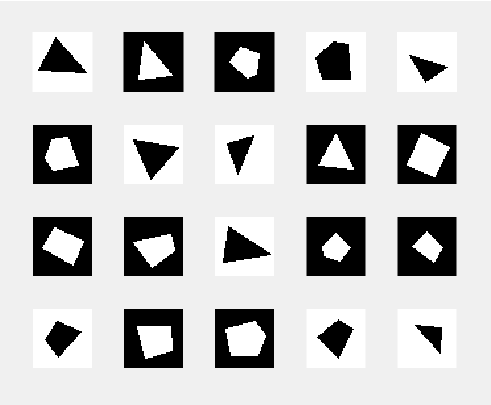

## Neural Network architecture search through ensemble of models

When you try to classify points inside a triangle vs outside of the triangle, you only need tree lines. If you train a shallow network with 4 neurons and an ouput neuron, one of the hidden neurons always becomes redundent. So, this problem can be solved with 3 neurons. The idea is that by looking at ensemble of models near an optimum, we can make tuning for the architecture of the network by lloking at covariances within model parameters near optimum.

Pros:
* Slimming networks always helpful for downstream applications, especially when you have limited capacity to store model parameters or you want to call forward function many many times.
* this would also allow us to visualize the loss landscape around a local optimum.

Cons:
* It is hard to calculate covariances for big matrices. Even though this approach gives benetifts downstream, it requires huge computational cost upfront.

### Data
I have generated polygons with 3, 4, and 5 sides. Generating my own dataset for this problem allow me play with the features that network utilize to classify these objects. For instance, When you have a fix radius to generate polygons, you will have different white vs black pixel ratios for triangle, tetragons and pentagons. Network learns to exploit this and minimal network would not do a good job classifying test dataset with various sizes of polygons. This way, one can test if the deep neural networks are learning relevant statistical features or short cuts in complex tasks.

### Code
*generatePolygons.py* and *compileDatasets.py* generates polygon images and create a dataset.
*Ensemble_Models.ipynb* trains ensemble of neural network models either thougrh training many networks or sampling network parameters around an optimum points. Then calculates covariance in the ensemble using *pairwise_correlations.py*

#### Acknowledgments
Sam Melton, Sharad Ramanathan for ideas and discussions.